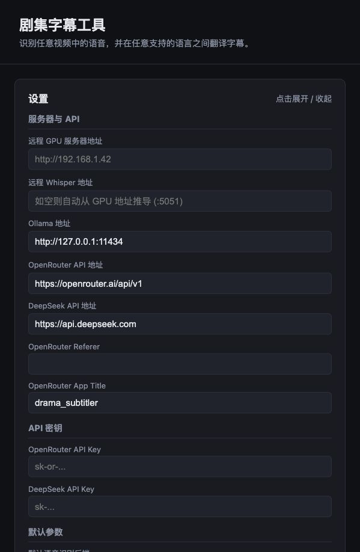
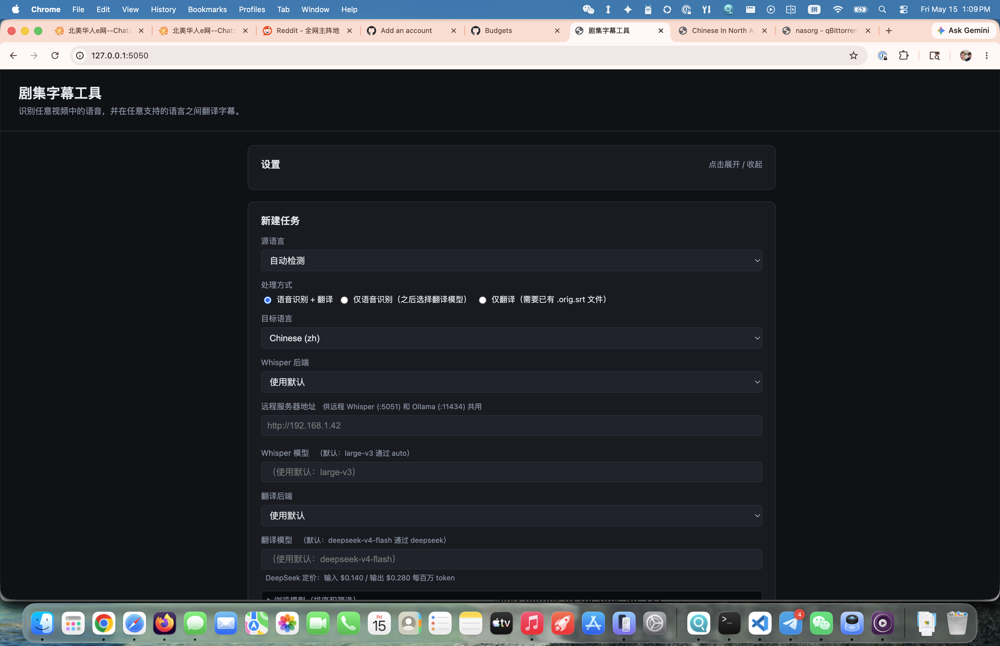
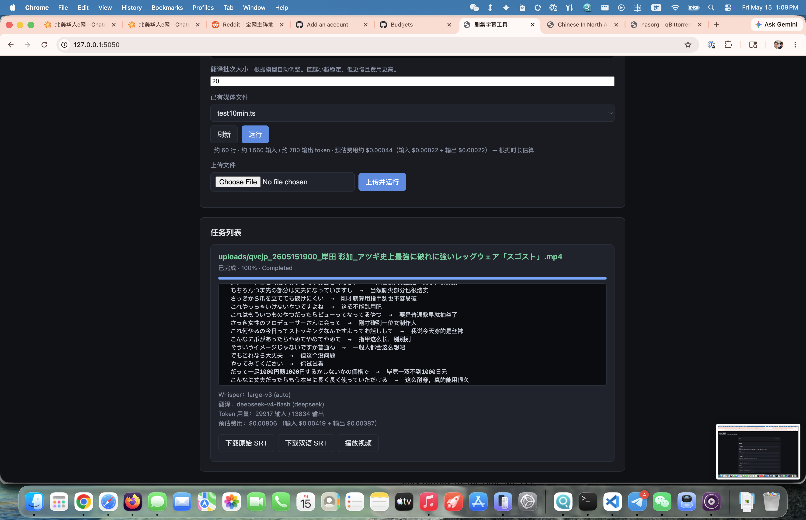

# drama_subtitler

用 Whisper 将视频对白转成文字，再用 LLM 翻译成双语字幕（原文 + 译文）。

你可以使用任意 Whisper 支持的源语言和任意目标语言，但本项目**开发并实测的主要场景**是：
- 源语言：**日语**（`ja`）、**韩语**（`ko`）
- 目标语言：**简体中文**（`zh`）

项目中针对性的处理（如 mojibake 修复的编码回退 `cp932` / `cp949` / `euc-kr`）也是围绕 CJK 环境设计的。

## 功能

- **Whisper 语音转文字**：支持 `faster-whisper`、远程 GPU `faster-whisper`、`whisper.cpp`（Apple Silicon 上自动选用后者）和 OpenAI Whisper API。
- **自动语言识别**：支持 Whisper 能识别的任意源语言。
- **多翻译后端**：
  - `ollama` — 本地 `/api/chat` 端点。
  - `openrouter` — 云端 OpenAI-compatible API，支持 SSE 流式输出。
  - `deepseek` — DeepSeek 官方 API。
- **远程 GPU 支持**：可把 Whisper 语音转文字和 Ollama 翻译跑在另一台局域网电脑（例如 Windows + NVIDIA 游戏 PC）上，本机只负责抽取音频、上传、调度和写 SRT。
- **输出**：
  - `<media>.orig.srt` — 源语言字幕。
  - `<media>.bilingual.srt` — 双语字幕（原文 + 译文，逐条显示）。
- **可配置目标语言**：通过 `TARGET_LANGUAGE` 环境变量或 `--target-language` 参数切换（默认 `zh`）。
- **断点续跑**：`--skip-transcription` 可复用已有的 `.orig.srt` 重新翻译。
- **Web UI**：小型 Flask 界面，支持上传、进度跟踪、下载。

## 安装

### macOS / Linux

```bash
python3.12 -m venv .venv
source .venv/bin/activate
pip install -r requirements.txt
```

### Windows fresh clone

在 PowerShell 里：

```powershell
git clone <repo-url> drama_subtitler
cd drama_subtitler
Set-ExecutionPolicy -Scope Process Bypass
.\scripts\setup-windows.ps1
```

推荐先装好系统工具：

```powershell
winget install Python.Python.3.12
winget install Git.Git
winget install Gyan.FFmpeg
winget install Ollama.Ollama
```

如果你要在 Windows/NVIDIA 机器上本机跑语音转文字，确认 NVIDIA 驱动可用，并优先使用：

```powershell
WHISPER_BACKEND=faster-whisper
WHISPER_DEVICE=auto
WHISPER_COMPUTE_TYPE=auto
```

`faster-whisper` 第一次运行会下载模型到 Hugging Face cache。`large-v3` 约 3GB；想先试通流程可以用 `small` 或 `medium`。

如果本机 GPU 语音转文字报 `cublas64_12.dll` / `cudnn*.dll` 找不到，通常是 CUDA/cuDNN runtime 没在 Windows `PATH` 里。先确认 NVIDIA 驱动正常，再按 NVIDIA cuDNN Windows 文档安装运行时。

Windows 自检：

```powershell
.\scripts\check-windows.ps1
```

系统依赖：

- `ffmpeg` 必须在 `PATH` 中（两个 Whisper 后端都需要）。
- 如果要直接复用日本电视 TS 文件里的 `[字]` 字幕，`ffmpeg` 还需要支持
  `arib_caption` 解码。普通 Homebrew `ffmpeg` 可能没有这个解码器；macOS
  可使用支持 `--with-libaribcaption` 的 ffmpeg 构建，或自行编译带
  `libaribcaption` 的 ffmpeg。
- 使用 `whisper.cpp` 时：安装 `whisper-cli`，并将 ggml 模型放到 `models/ggml-<MODEL>.bin`（或设置 `WHISPER_CPP_MODEL_PATH`）。
- 使用 `ollama` 时：需要运行中的 Ollama 守护进程（默认 `http://127.0.0.1:11434`，或由 `GPU_BASE_URL` 派生为 `<GPU_BASE_URL>:11434`）。
- 使用 `openrouter` 或 `deepseek` 时：在 `.env` 中填入对应的 API Key。

复制 `.env.example` 为 `.env` 并按需编辑。

## 命令行用法

```bash
# 语音转文字 + 翻译（自动识别源语言）
python subtitle_pipeline.py path/to/episode.mkv

# 相对 MEDIA_DIR 解析文件路径
python subtitle_pipeline.py episode.mkv

# 复用已有转文字结果重新翻译
python subtitle_pipeline.py episode.mkv --skip-transcription

# 强制指定源语言
python subtitle_pipeline.py episode.mkv --source-language ko

# 切换目标语言
python subtitle_pipeline.py episode.mkv --target-language en

# 调试时实时查看模型流式输出
python subtitle_pipeline.py episode.mkv --show-translation-stream

# 使用局域网 Windows/NVIDIA 机器转文字，且用同一台机器的 Ollama 翻译
python subtitle_pipeline.py episode.mkv \
  --whisper-backend remote-faster-whisper \
  --translation-backend ollama \
  --gpu-base-url http://192.168.1.42
```

Windows PowerShell 示例：

```powershell
.\.venv\Scripts\python.exe .\subtitle_pipeline.py "D:\Videos\episode01.mkv" `
  --whisper-backend faster-whisper `
  --whisper-model large-v3 `
  --translation-backend ollama `
  --translation-model qwen2.5:14b `
  --target-language zh
```

## 远程 GPU 机器设置

`contrib/` 里包含独立运行所需的辅助脚本：

```bash
contrib/whisper-server.py              # 在 GPU 机器上运行的 faster-whisper HTTP 服务
contrib/check-gpu-services.sh          # 在本机检查 Whisper :5051 和 Ollama :11434
contrib/start-drama-subtitler-gpu.ps1  # Windows PowerShell 启动/检查脚本
```

Windows GPU 机器上的常见流程。如果已经在仓库根目录运行过 `.\scripts\setup-windows.ps1`，可以跳过创建虚拟环境和安装依赖，直接运行 `.\contrib\start-drama-subtitler-gpu.ps1`。GPU helper 会优先使用 `.venv`，也兼容旧的 `venv` 目录。

```powershell
py -3.12 -m venv .venv
.\.venv\Scripts\Activate.ps1
pip install faster-whisper flask
.\contrib\start-drama-subtitler-gpu.ps1 -OllamaModel qwen2.5:14b -WhisperModel large-v3
```

如果是通过 pip 安装包，也可以直接运行：

```powershell
drama-subtitler-whisper-server --host 0.0.0.0 --port 5051 --model large-v3
```

然后在运行 `drama_subtitler` 的机器上设置：

```bash
GPU_BASE_URL=http://192.168.1.42
WHISPER_BACKEND=remote-faster-whisper
TRANSLATION_BACKEND=ollama
TRANSLATION_MODEL=qwen2.5:14b
```

也可以在 Web UI 里为单个任务选择 "Remote GPU faster-whisper"、填写 `GPU_BASE_URL`，并把翻译后端切到 Ollama。

## Web UI

```bash
python run.py --port 5050
```

打开 http://localhost:5050。界面会列出 `MEDIA_DIR` 下的媒体文件，支持上传和实时进度查看。

Windows:

```powershell
.\scripts\run-web-windows.ps1 -Browser -MediaDir "D:\Videos"
```

### 界面预览

**设置面板** — 直接在网页里填写 API Key、远程 GPU 地址、选择默认模型，无需手动编辑 `.env`：



**新建任务** — 选择源语言、目标语言（中文/英文）、Whisper 后端和翻译后端，支持从已有媒体文件直接运行或上传新视频：



**任务完成** — 实时显示语音识别 + 翻译进度，完成后可下载原始字幕、双语字幕，或一键播放视频：



**播放视频** — 点击「播放视频」按钮，自动调用系统默认播放器（mpv/VLC 等）打开视频，加载生成的双语字幕：


## 项目结构

```
drama_subtitler/
├── subtitle_pipeline.py        # CLI 入口
├── run.py                      # Flask 启动脚本
├── config.py                   # 环境变量配置
├── app/
│   ├── __init__.py             # Flask create_app 工厂
│   ├── routes.py               # REST API 与前端路由
│   ├── models/
│   │   ├── subtitle_pipeline.py   # 核心引擎：语音转文字 + 翻译
│   │   └── cost_estimator.py      # 费用估算
│   ├── templates/index.html
│   └── static/{css,js}/...
├── contrib/                     # 远程 GPU Whisper/Ollama helper
├── scripts/                     # Windows setup/run/check helper
├── tests/                      # 单元测试
└── media/                      # 默认 MEDIA_DIR（按需创建）
```

## 技术文档

详见 [TECHNICAL.md](TECHNICAL.md)，包含架构设计、核心模块详解、数据流和扩展指南。

## 法律声明 / 免责声明

`drama_subtitler` 仅从你已有的本地视频文件生成字幕文件（SRT）。它**不会**下载、托管、流媒体传输或分发任何受版权保护的内容，也不会绕过 DRM 或其他技术保护措施。

你在使用本工具时完全对自己的行为负责。

## 开源许可

MIT — 详见 [LICENSE](LICENSE)。

欢迎提交 PR，提交前请运行 `pytest -v` 确保测试通过。
